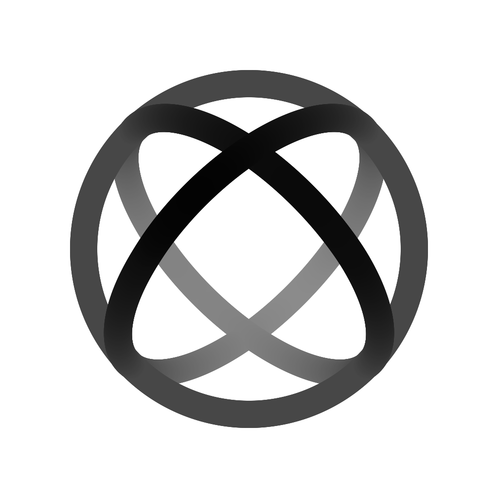

  <picture>
    <source media="(prefers-color-scheme: dark)" srcset="./assets/cordisx-mark-dark.svg">
    <source media="(prefers-color-scheme: light)" srcset="./assets/cordisx-mark-light.svg">
    
  </picture>

# CordisX

An open extension ecosystem that turns AI coding clients into your workspace.

CordisX brings plugins into mature AI coding tools instead of asking users to
replace the accounts, models, projects, tasks, and conversations they already
trust. Developers define actions, data, pages, workflows, and the host
capabilities they need; CordisX handles host adaptation, native-feeling UI,
navigation and cleanup, localization, permission prompts, model and task
access, configuration, compatibility diagnostics, and plugin discovery.

[Codex Desktop](https://github.com/openai/codex) is the first host adapter, not
the boundary of the ecosystem. Future adapters can bring the same plugin model
to Claude Code, ZCode, and other AI coding clients without hard-coding one
provider, model, or marketplace.

CordisX is an unofficial, opt-in community project. It is not an OpenAI product
and does not modify installed host applications.

Explore the [CordisX product and architecture](https://github.com/cordisx/cordisx)
or browse the [community marketplace](https://github.com/cordisx/marketplace).
